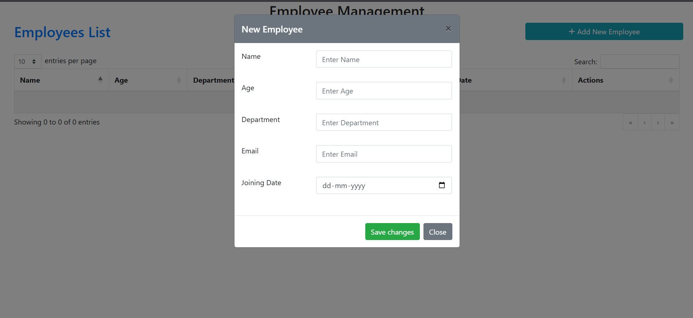
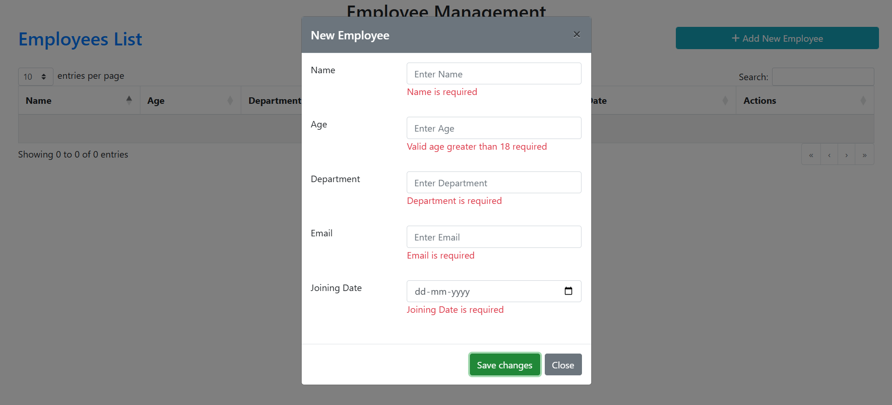
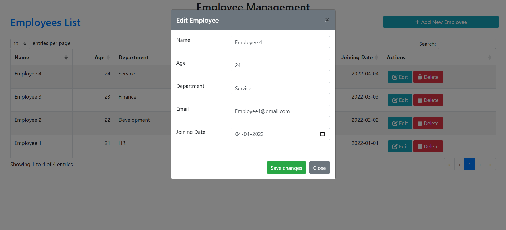

# 👨‍💼 Employee Management - Frontend

This is the **frontend** of the Employee Management System built with **React.js**. It allows users to add, edit, delete, and view employee records using a clean UI, enhanced with modals, validation, alerts, and DataTables.

---

## 🚀 Features

- 📝 Add / Edit / Delete Employees  
- 📧 Email uniqueness validation  
- 🛎️ Toast & SweetAlert2 for notifications and confirmations  
- 📊 Integrated DataTables for sorting, searching & pagination  
- 🎨 FontAwesome icons for cleaner UI  
- 📅 Form validation with error highlighting  

---

## 📸 UI Preview

### 🧾 Initial View (Empty Table)

> Displayed when there are no employee records yet.


---

### ➕ Add Employee Form

> Modal form to add a new employee. Includes validation and submit handling.




---

### 📋 Table with Employee Data

> Main table view showing the list of employees with action buttons for edit/delete.


---

### ✏️ Edit Employee Form

> Pre-filled modal form used to update existing employee information.



---

### ❗ Confirmation Dialog

> SweetAlert2 dialog asking for confirmation before deleting a record.


---

### ✅ Notification & Alerts

> Toastr and SweetAlert2 provide feedback after successful or failed operations.


---

## ⚙️ Setup Instructions

### 🔧 Prerequisites

- Node.js & npm installed

### 📦 Getting Started

```bash
# Clone the repository
git clone https://github.com/manishK1706/EM-React-DotNET.git

# Navigate to the frontend folder
cd EM-React-DotNET/em-frontend

# Install dependencies
npm install

# Start the development server
npm start
